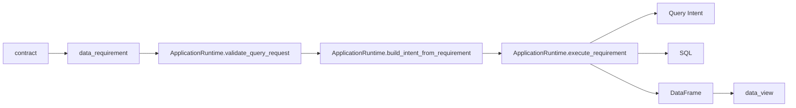

# AlphaBlocks Integration Example

## 目标

这份文档说明 `AlphaBlocks` / `protocol_core` 如何对接 `AIQuantBase` 当前的应用层接口。

目标是把这条链跑顺：

1. `contract`
2. `data_requirement`
3. `ApplicationRuntime`
4. `sql + DataFrame`
5. `data_view`

## 1. 当前推荐入口

对接 `AlphaBlocks` 时，推荐使用：

```python
from aiquantbase import ApplicationRuntime

runtime = ApplicationRuntime.from_defaults()
```

不要让上层直接：

1. 记底层表名
2. 自己猜 node
3. 直接拼 SQL

## 2. 最小对接流程

### Step 1. 上层构造 `data_requirement`

例如：

```python
data_requirement = {
    "fields": ["close_adj", "open", "industry_name"],
    "scope": {
        "symbols": ["000001.SZ"],
        "freq": "1d",
        "start": "2025-01-01",
        "end": "2025-01-31",
    },
}
```

### Step 2. 执行 requirement

```python
result = runtime.execute_requirement(data_requirement)
```

### Step 3. 取结果

```python
if not result["ok"]:
    raise RuntimeError(result["issues"])

df = result["df"]
sql = result["debug"]["sql"]
intent = result["debug"]["intent"]
```

这样上层就拿到了：

1. `df`
2. `sql`
3. `intent`
4. `resolved`

## 3. 推荐接法 1：直接执行 requirement

这是最推荐的接法。

```python
from aiquantbase import ApplicationRuntime

runtime = ApplicationRuntime.from_defaults()

def fetch_data(data_requirement: dict):
    result = runtime.execute_requirement(data_requirement)
    if not result["ok"]:
        return {
            "ok": False,
            "issues": result["issues"],
            "resolved": result["resolved"],
        }

    return {
        "ok": True,
        "df": result["df"],
        "sql": result["debug"]["sql"],
        "intent": result["debug"]["intent"],
        "resolved": result["resolved"],
    }
```

适合：

1. 上层只想表达“我要什么数据”
2. 不想自己处理 node / intent / SQL

## 4. 推荐接法 2：先校验，再执行

如果你想把错误更早暴露出来，可以走两步：

```python
validation = runtime.validate_query_request(
    {
        "symbols": ["159102.SZ"],
        "universe": None,
        "fields": ["close_adj", "open", "is_st"],
        "start": "2024-01-01",
        "end": "2024-01-31",
        "freq": "1d",
        "asset_type": "auto",
    }
)

if not validation["ok"]:
    print(validation["issues"])
else:
    result = runtime.execute_requirement(
        {
            "fields": ["close_adj", "open"],
            "scope": {
                "symbols": ["159102.SZ"],
                "freq": "1d",
                "start": "2024-01-01",
                "end": "2024-01-31",
            },
        }
    )
```

适合：

1. 上层需要先展示“这份查询是否可行”
2. 需要把问题返回给 AI 或调用方

## 5. 推荐接法 3：先看字段能力再构造 requirement

如果上层要做字段选择器或字段检查，建议：

```python
supported = runtime.get_supported_fields(asset_type="stock", freq="1d")
```

例如只拿财务字段：

```python
financial_fields = runtime.get_supported_fields(
    asset_type="stock",
    freq="1d",
    field_role="financial_field",
)
```

例如只拿派生字段：

```python
derived_fields = runtime.get_supported_fields(
    asset_type="stock",
    freq="1d",
    derived_only=True,
)
```

适合：

1. 上层做字段可用性展示
2. AI 先看字段支持，再生成 requirement

## 6. 推荐接法 4：先解析 symbol

如果上层只拿到 symbol，不知道资产类型，可以先：

```python
resolved = runtime.resolve_symbols(["000001.SZ", "159102.SZ", "123085.SZ"])
```

返回会告诉你：

1. `stock`
2. `etf`
3. `kzz`

这一步适合：

1. 在上层区分股票、ETF、可转债
2. 避免把 ETF 错当股票查

## 7. requirement -> intent -> sql -> df 链路图



## 8. 当前推荐的上层调用顺序

### 最简版

1. `execute_requirement(data_requirement)`

### 稍稳版

1. `resolve_symbols(symbols)`
2. `get_supported_fields(...)`
3. `validate_query_request(request)`
4. `execute_requirement(data_requirement)`

## 9. 当前不建议上层做的事

1. 上层自己记 `stock_daily_real` / `etf_pcf_real` 之外的底层细节
2. 上层直接拼 SQL 作为主路径
3. 上层自己处理图谱 join
4. 上层自己猜 `159102.SZ` 应该查哪个 node

## 10. 一句话总结

`AlphaBlocks` 只需要负责表达：

1. 我想要哪些字段
2. 时间范围是什么
3. 标的是谁
4. 频率是什么

`AIQuantBase` 负责：

1. symbol 解析
2. 字段支持判断
3. 节点选择
4. 对不支持的资产类型前置报错
5. Query Intent 构造
6. SQL 生成与执行
