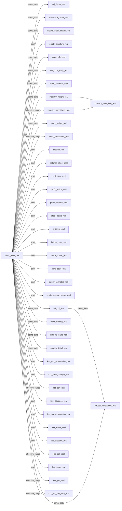
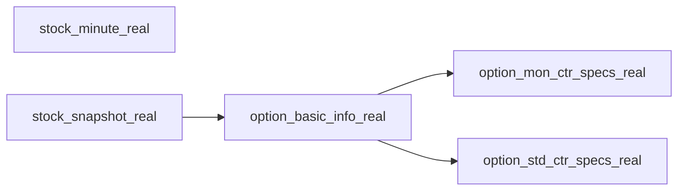
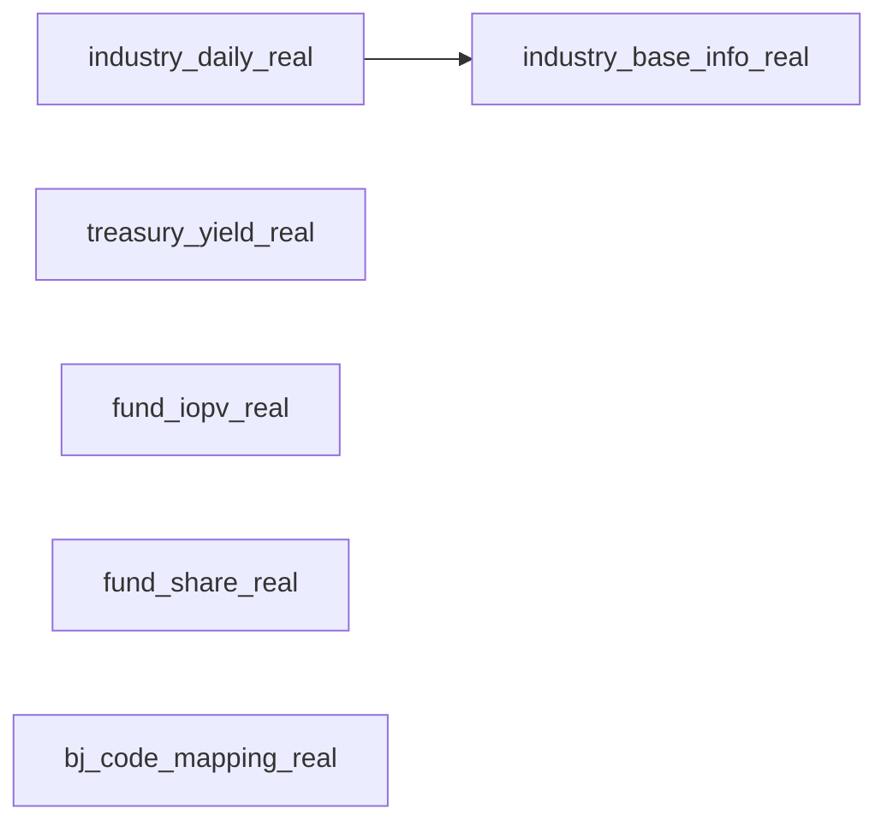
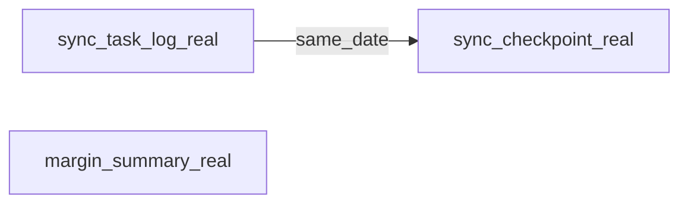

# Final Graph Relationship

## 概览

当前最终图谱规模：

1. `54` 个节点
2. `47` 条关系边

主入口节点主要有：

1. `stock_daily_real`
2. `stock_minute_real`
3. `stock_snapshot_real`
4. `industry_daily_real`
5. `fund_iopv_real`
6. `fund_share_real`
7. `treasury_yield_real`
8. `sync_task_log_real`
9. `margin_summary_real`

## 1. 股票日线主干图

## 2. 分钟 / 快照 / 期权图

## 3. 行业 / 指数 / ETF / 基金 / 宏观图

## 4. 系统运维图

## 5. 业务域分组

### A. 行情与状态

1. `stock_daily_real`
2. `stock_minute_real`
3. `stock_snapshot_real`
4. `adj_factor_real`
5. `backward_factor_real`
6. `history_stock_status_real`
7. `trade_calendar_real`
8. `code_info_real`
9. `hist_code_daily_real`

### B. 股本与公司行为

1. `equity_structure_real`
2. `dividend_real`
3. `right_issue_real`
4. `equity_restricted_real`
5. `equity_pledge_freeze_real`
6. `holder_num_real`
7. `share_holder_real`

### C. 财务报表与业绩

1. `income_real`
2. `balance_sheet_real`
3. `cash_flow_real`
4. `profit_notice_real`
5. `profit_express_real`
6. `stock_basic_real`

### D. 行业与指数

1. `industry_weight_real`
2. `industry_constituent_real`
3. `industry_base_info_real`
4. `industry_daily_real`
5. `index_weight_real`
6. `index_constituent_real`

### E. ETF 与基金

1. `etf_pcf_real`
2. `etf_pcf_constituent_real`
3. `fund_iopv_real`
4. `fund_share_real`

### F. 可转债

1. `kzz_call_explanation_real`
2. `kzz_conv_change_real`
3. `kzz_corr_real`
4. `kzz_issuance_real`
5. `kzz_put_explanation_real`
6. `kzz_share_real`
7. `kzz_suspend_real`
8. `kzz_call_real`
9. `kzz_conv_real`
10. `kzz_put_real`
11. `kzz_put_call_item_real`

### G. 期权

1. `option_basic_info_real`
2. `option_mon_ctr_specs_real`
3. `option_std_ctr_specs_real`

### H. 交易事件与资金事件

1. `block_trading_real`
2. `long_hu_bang_real`
3. `margin_detail_real`
4. `margin_summary_real`

### I. 参考与系统

1. `bj_code_mapping_real`
2. `treasury_yield_real`
3. `sync_task_log_real`
4. `sync_checkpoint_real`

## 6. 时间绑定规则总览

当前图谱里主要使用 4 类时间绑定：

1. `same_date`
   适用于日快照、事件日、逐日映射

2. `asof`
   适用于公告后生效、最近可得口径

3. `effective_range`
   适用于区间条款、成分生效区间

4. `none`
   适用于纯键值映射或静态参考信息

## 7. 当前关系文件

如果你后面要继续扩图谱，当前主配置文件就是：

1. [real_combined_graph.yaml](/Users/zhao/Desktop/git/AIQuantBase/examples/real_combined_graph.yaml)
2. [real_combined_fields.yaml](/Users/zhao/Desktop/git/AIQuantBase/examples/real_combined_fields.yaml)
